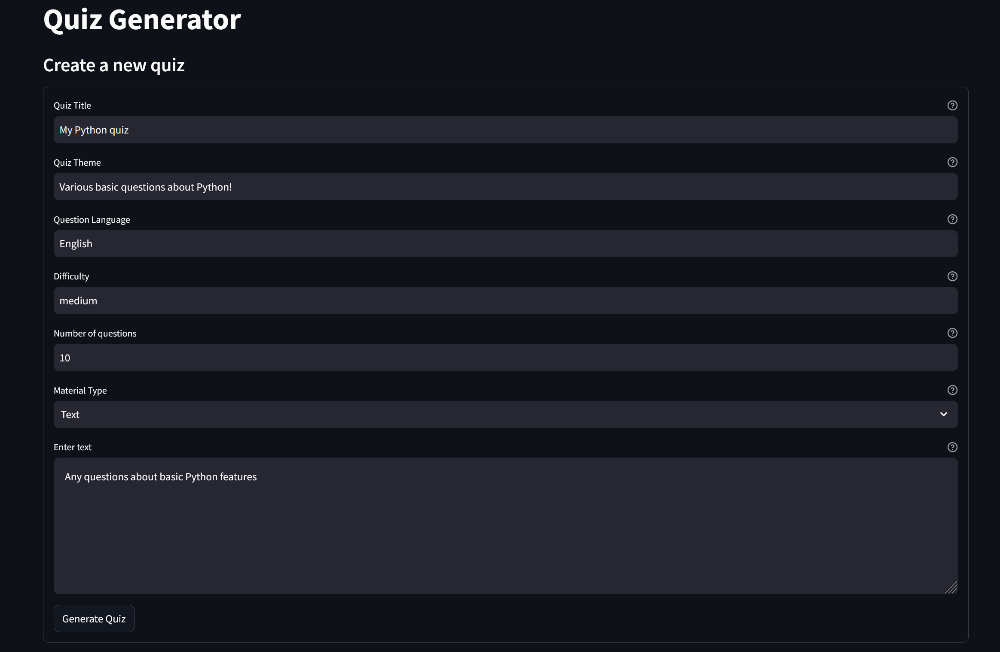
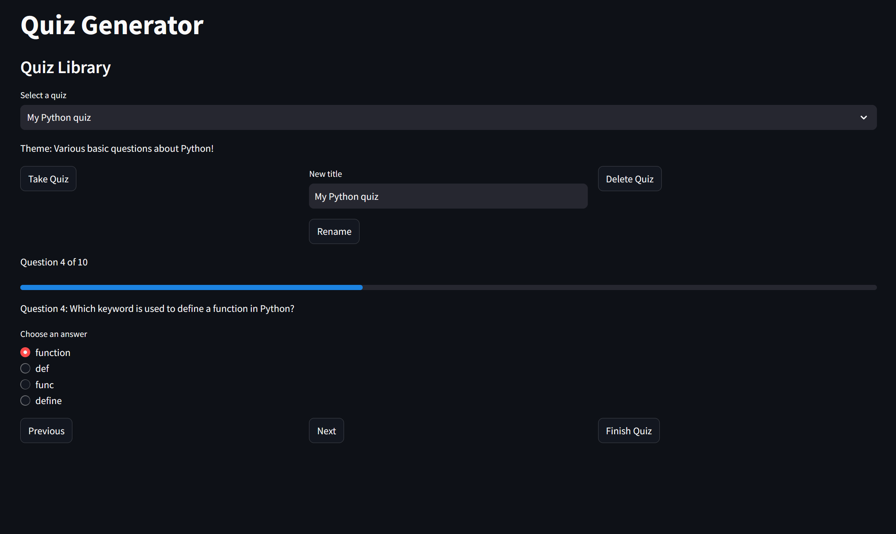
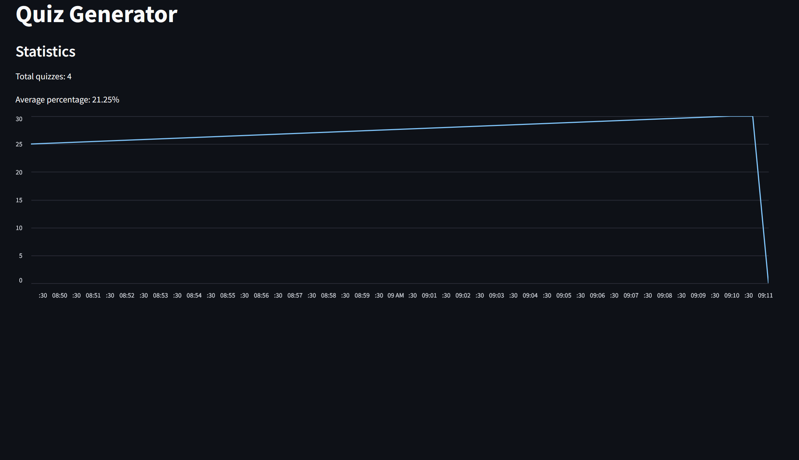

# Quizzy


*Создавайте и проходите квизы **легко** и **бесплатно**!*

**Quizzy** — это веб-приложение на базе Streamlit, которое позволяет генерировать квизы на основе текстового материала, проходить их в интерактивном пошаговом формате и получать подробные результаты. Проект использует API Google Gemini для генерации вопросов и идеально подходит для обучения, тестирования знаний или просто развлечения.

---

## Основные возможности

- **Генерация квизов**: Создавайте квизы из текста или загруженного файла с настройкой темы, языка, сложности и количества вопросов.
- **Интерактивное прохождение**: Отвечайте на вопросы пошагово с прогресс-баром и удобной навигацией ("Назад"/"Далее").
- **Подробные результаты**: После завершения квиза получайте таблицу с вашими ответами, правильными ответами и статусом.
- **Управление библиотекой**: Переименовывайте и удаляйте квизы с подтверждением действий.
- **Системная тема**: Интерфейс адаптируется к светлой или тёмной теме вашей системы.

---

## Скриншоты

| Создание квиза | Прохождение квиза | Результаты |
|----------------|-------------------|------------|
|  |  |  |


---

## Попробовать приложение
**на [Streamlit](https://quizzy-ai.streamlit.app/)**

для локальной развёртки смотреть секцию ниже

---

## Установка

### Требования
- Python 3.8+
- Git

### Шаги
1. **Клонируйте репозиторий**:
   ```
   git clone https://github.com/pyramidheadshark/quizzy-ai-quiz.git
   cd quizzy-ai-quiz
   ```

2. **Создайте виртуальное окружение** (опционально, но рекомендуется):
   ```
   python -m venv .venv
   source .venv/bin/activate  # Linux/Mac
   .venv\Scripts\activate     # Windows
   ```

3. **Установите зависимости**:
   ```
   pip install -r requirements.txt
   ```

4. **Настройте API-ключ**:
   - Получите ключ API для Google Gemini на [Google AI Studio](https://aistudio.google.com/).
   - Создайте файл `.env` в корневой директории проекта и добавьте:
     ```
     GEMINI_API_KEY=your_api_key_here
     ```

5. **Запустите приложение**:
   ```
   streamlit run app.py
   ```
   Откройте браузер по адресу `http://localhost:8501`.

---

## Использование

1. **Создание квиза**:
   - Перейдите на страницу "Создать квиз".
   - Заполните поля: название, тема, язык, сложность, количество вопросов.
   - Выберите тип материала (текст или файл) и введите/загрузите материал.
   - Нажмите "Сгенерировать квиз".

2. **Прохождение квиза**:
   - На странице "Библиотека квизов" выберите квиз и нажмите "Пройти квиз".
   - Отвечайте на вопросы, используя кнопки "Назад" и "Далее".
   - Завершите квиз, нажав "Завершить квиз".

3. **Управление квизами**:
   - Переименуйте квиз, введя новое название и нажав "Переименовать".
   - Удалите квиз с подтверждением через "Удалить квиз".

4. **Просмотр статистики**:
   - На странице "Статистика" смотрите графики и данные о ваших результатах.

---

## Структура проекта

```
quiz-generator/
├── app.py                  # Главный файл приложения
├── requirements.txt        # Список зависимостей
├── .env                    # Файл с API-ключами (добавить в .gitignore)
├── data/                   # Папка для хранения данных
│   └── quizzes/            # Сохранённые квизы в формате JSON
├── modules/                # Модули приложения
│   ├── __init__.py
│   ├── quiz.py            # Класс Quiz
│   ├── quiz_manager.py    # Управление квизами
│   ├── quiz_generator.py  # Генерация вопросов
│   ├── data_storage.py    # Хранение данных
│   └── statistics.py      # Статистика прохождения
└── README.md              # Его вы сейчас читаете
```

---

## Зависимости

- `streamlit` — для создания веб-интерфейса.
- `google-generativeai` — для генерации вопросов через Google Gemini.
- `python-dotenv` — для работы с переменными окружения.
- `pandas` — для обработки статистики.

Полный список в `requirements.txt`.

---

## Вклад в проект

1. Форкните репозиторий.
2. Создайте новую ветку:
   ```
   git checkout -b feature/your-feature-name
   ```
3. Внесите изменения и закоммитьте:
   ```
   git commit -m "Add your feature"
   ```
4. Отправьте изменения:
   ```
   git push origin feature/your-feature-name
   ```
5. Создайте Pull Request.

---

## Лицензия

Проект распространяется под лицензией [MIT License](LICENSE). Вы можете свободно использовать, изменять и распространять код.

---

## Контакты

Если у вас есть вопросы или предложения:
- **GitHub Issues**: [Создать задачу](https://github.com/pyramidheadshark/quizzy-ai-quiz/issues)

